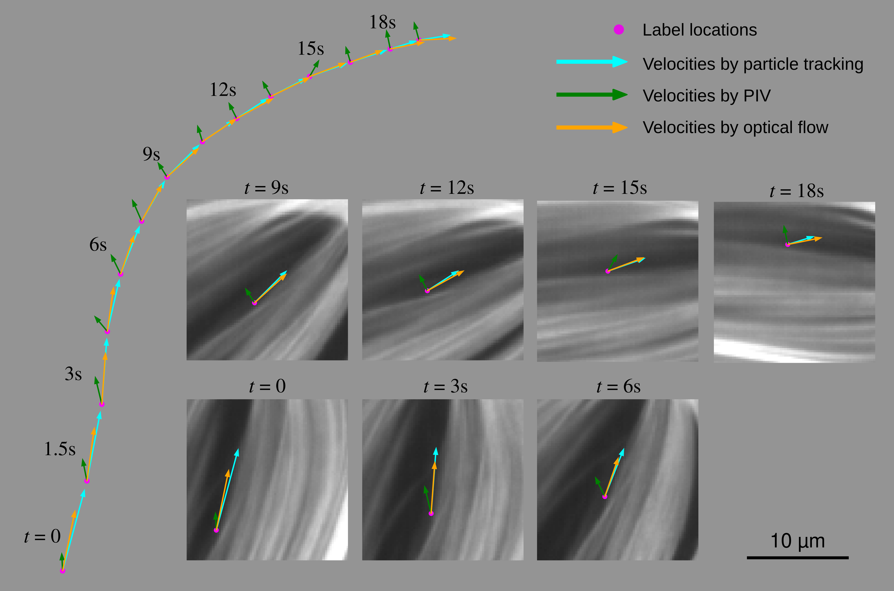

# Deep-learning Optical Flow Outperforms PIV in Obtaining Velocity Fields from Active Nematics

**Deep-learning Optical Flow Outperforms PIV in Obtaining Velocity Fields from Active Nematics**<br/>
Phu N. Tran, Sattvic Ray, Linnea Lemma, Yunrui Li, Reef Sweeney, Aparna Baskaran, Zvonimir Dogic, Pengyu Hong, Michael F. Hagan

Link to arXiv Paper: [**https://arxiv.org/abs/2404.15497**](https://arxiv.org/abs/2404.15497)



## Abstract
Deep learning-based optical flow (DLOF) extracts features in adjacent video frames with deep convolutional neural networks. It uses those features to estimate the inter-frame motions of objects at the pixel level. In this article, we evaluate the ability of optical flow to quantify the spontaneous flows of MT-based active nematics under different labeling conditions. We compare DLOF against the commonly used technique, particle imaging velocimetry (PIV). We obtain flow velocity ground truths either by performing semi-automated particle tracking on samples with sparsely labeled filaments, or from passive tracer beads. We find that DLOF produces significantly more accurate velocity fields than PIV for densely labeled samples. We show that the breakdown of PIV arises because the algorithm cannot reliably distinguish contrast variations at high densities, particularly in directions parallel to the nematic director. DLOF overcomes this limitation. For sparsely labeled samples, DLOF and PIV produce results with similar accuracy, but DLOF gives higher-resolution fields. Our work establishes DLOF as a versatile tool for measuring fluid flows in a broad class of active, soft, and biophysical systems.

## Requirements
A CUDA-compatible GPU is required to run the code. A Python environment can be created using 

```
conda env create -f environment.yaml
conda activate opticalflow
```
## Running a simple example
```
conda activate opticalflow
cd /path/to/opticalflow
python example/example.py
```
The above code takes two images in the directory ```./example/data``` as inputs to the model, and generate velocity plot at ```./example/velocity_plot.png```. The velocity field is plotted on the top of the first image.

## Acnkowlegments
This work largely adopted source code from the RAFT paper:
```
@misc{teed2020,
      title={RAFT: Recurrent All-Pairs Field Transforms for Optical Flow}, 
      author={Zachary Teed and Jia Deng},
      year={2020},
      eprint={2003.12039},
      archivePrefix={arXiv},
      primaryClass={cs.CV}
}
```

## BibTeX
Consider to cite us and RAFT paper if you find the analysis in this work helpful.
```
@misc{tran2024,
      title={Deep-learning Optical Flow Outperforms PIV in Obtaining Velocity Fields from Active Nematics}, 
      author={Phu N. Tran and Sattvic Ray and Linnea Lemma and Yunrui Li and Reef Sweeney and Aparna Baskaran and Zvonimir Dogic and Pengyu Hong and Michael F. Hagan},
      year={2024},
      eprint={2404.15497},
      archivePrefix={arXiv},
      primaryClass={cond-mat.soft}
}
```